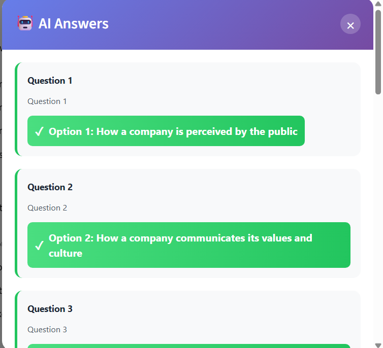

# 🤖 Coursera AI Answer Finder

A Chrome extension that uses AI to help find answers to multiple-choice questions on Coursera and similar learning platforms.

 


)
## ✨ Features

- 🔍 **Automatic Question Detection** - Scans pages for multiple-choice questions
- 🤖 **AI-Powered Answers** - Uses free AI APIs to suggest answers
- 🎨 **Beautiful Answer Display** - Shows answers in a clean, easy-to-read modal
- 💚 **Visual Highlighting** - Highlights correct answers on the page (when possible)
- 🚀 **Multiple AI Providers** - Falls back to different free APIs for reliability
- 🔑 **Optional Groq API** - Add your own Groq API key for faster, more reliable results

## 📸 Screenshots

### 🔹 Extension Popup
  
*Simple, clean interface with two main functions*

### 🔹 Answer Modal
  
*Beautiful answer display with all questions and correct options*


## 🚀 Installation

### Option 1: Install from Source

1. **Download the extension**
   ```bash
   git clone https://github.com/yourusername/coursera-ai-answer-finder.git
   cd coursera-ai-answer-finder
   ```

2. **Load in Chrome**
   - Open Chrome and go to `chrome://extensions/`
   - Enable "Developer mode" (toggle in top-right)
   - Click "Load unpacked"
   - Select the extension folder

3. **(Optional) Add your Groq API key**
   - Get a free API key from [console.groq.com](https://console.groq.com/keys)
   - Open `popup.js`
   - Find line 5: `const GROQ_API_KEY = "";`
   - Add your key: `const GROQ_API_KEY = "gsk_your_key_here";`

### Option 2: Install from Release

1. Download the latest `.zip` file from [Releases](https://github.com/yourusername/coursera-ai-answer-finder/releases)
2. Unzip the file
3. Follow step 2 from Option 1 above

## 📖 How to Use

1. **Navigate to a quiz page** on Coursera or similar platform
2. **Click the extension icon** in your Chrome toolbar
3. **Click "Find Answers"** button
4. **View the results** in the popup modal that appears

The extension will:
- Scan the page for questions
- Send them to AI for analysis
- Display all answers in a beautiful modal
- Attempt to highlight answers on the page

## 🔧 Configuration

### Adding Your Own API Key (Recommended)

For better performance and reliability, add your own Groq API key:

1. **Get a free Groq API key**
   - Visit [console.groq.com](https://console.groq.com/)
   - Sign up (100% free)
   - Go to "API Keys" and create a new key

2. **Add to extension**
   - Open `popup.js`
   - Line 5: `const GROQ_API_KEY = "your_key_here";`
   - Save and reload extension

### Free APIs Used (No Key Required)

If you don't add an API key, the extension uses these free services:
- DeepInfra
- HuggingFace Inference API
- Groq (with your key)

## 🛠️ Technical Details

### File Structure

```
coursera-ai-answer-finder/
├── manifest.json          # Extension configuration
├── popup.html            # Extension popup UI
├── popup.js              # Popup logic and API calls
├── content.js            # Page interaction and question extraction
├── README.md             # This file
└── screenshots/          # Screenshots for README
```

### Technologies Used

- **Chrome Extension APIs** - For browser integration
- **Groq API** - Fast AI inference (optional)
- **HuggingFace API** - Free AI fallback
- **DeepInfra API** - Free AI fallback
- **Vanilla JavaScript** - No dependencies

## ⚠️ Disclaimer

**Educational Purpose Only**

This extension is created for educational and research purposes only. It is designed to:
- Help students understand question patterns
- Provide study assistance
- Demonstrate AI integration with browser extensions

**Important Notes:**
- Always verify AI-suggested answers yourself
- Use this tool to learn, not to cheat
- Respect your educational institution's honor code
- AI answers may not always be correct

The authors are not responsible for any misuse of this tool.

## 🤝 Contributing

Contributions are welcome! Here's how you can help:

1. **Fork the repository**
2. **Create a feature branch** (`git checkout -b feature/amazing-feature`)
3. **Commit your changes** (`git commit -m 'Add amazing feature'`)
4. **Push to the branch** (`git push origin feature/amazing-feature`)
5. **Open a Pull Request**

### Ideas for Contribution

- [ ] Support for more learning platforms (Udemy, edX, etc.)
- [ ] Better question extraction algorithms
- [ ] Answer confidence scoring
- [ ] Dark mode for the modal
- [ ] Export answers to PDF
- [ ] Multiple language support

## 🐛 Bug Reports

Found a bug? Please open an issue with:
- Chrome version
- Extension version
- Steps to reproduce
- Expected vs actual behavior
- Screenshots (if applicable)

## 📝 License

This project is licensed under the MIT License - see the [LICENSE](LICENSE) file for details.

## 🙏 Acknowledgments

- Thanks to [Groq](https://groq.com/) for their fast AI inference API
- Thanks to [HuggingFace](https://huggingface.co/) for free AI models
- Thanks to all contributors and users

## 📞 Contact

- 🐞 **GitHub Issues**  
  https://github.com/NamanAryan9/ContentCleaner/issues

- 💻 **GitHub Profile**  
  https://github.com/NamanAryan9


---

**⭐ If you find this helpful, please star the repository!**

Made with ❤️ by [Naman Aryan]